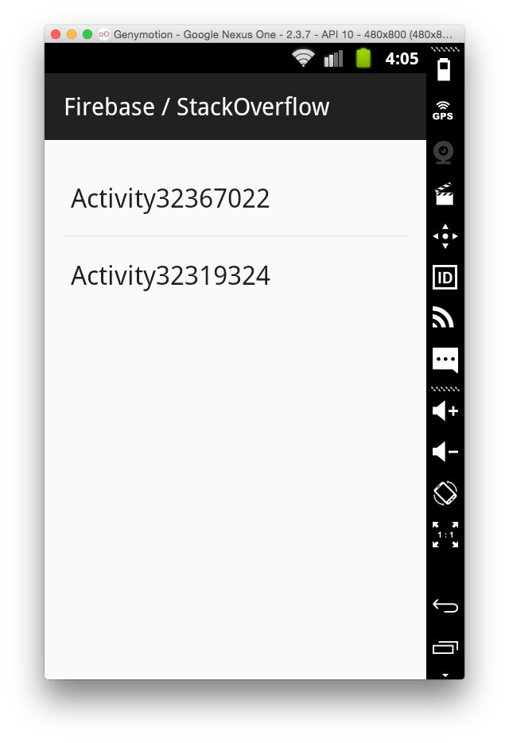
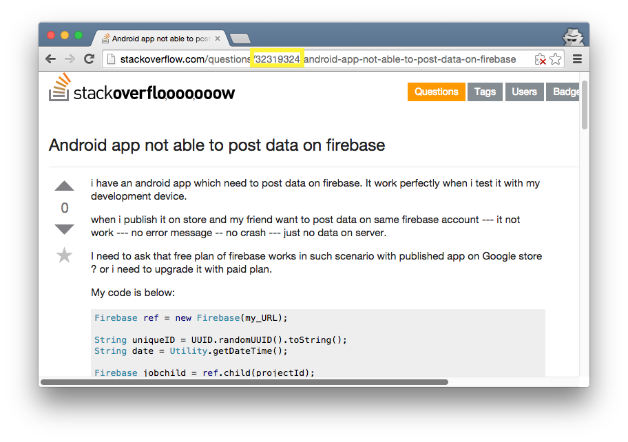

# firebase-stackoverflow-android
Sample app for answers on StackOverflow related to Firebase

This app's main activity lists all other activities:

Each activity is named after the question ID that it answers on StackOverflow:

When you click/tap one of the activity names, that activity will be run.
The exact result depends on the question that the activity was written for.